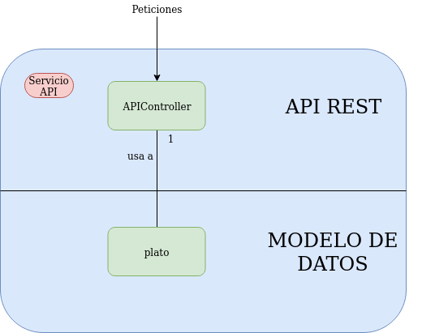

# Gestión Restaurante 

## Micro Servicio API

Se ha implementado un microservicio el cual tiene una API REST. Este servicio estará desplegado usando un servidor embebido de [Tomcat 7](https://spring.io/blog/2014/03/07/deploying-spring-boot-applications#embedded-web-server-deployment) que nos proporciona Spring Boot. Los comandos las peticiones que se le pueden hacer son las siguientes:

* **GET: restaurant/pedido/{id}**
  * Muestra los pedidos almacenasdos en la bd de mesa
* **POST: restaurant/pedido**
  * Para este comando es necesario pasarle un JSON como cuerpo con la siguiente estructura:

  ~~~ JSON
  "{"idmesa":0,
    "nombre":"plato0",
    "precio":1.4,
    "cantidad":1}"
  ~~~

  * Añade el pedido a la base de datos de mesas
* **POST: restaurant/pedido/send/{id}**
  * Envia una peticion a cocina por cada pedido que se encuentre guardado en una id. Cocina después se encargara de guardar los pedidos
  
* **DELETE: restaurant/pedido/{id}**
  * Borra todos los pedidos de una mesa almacenados en la bd de mesas
* **GET: restaurant/cocina/{id}**
  * Muestra los pedidos de una mesa almacenados en la cocina
* **POST: restaurant/cocina**
  * Para este comando es necesario pasarle un JSON como cuerpo con la siguiente estructura:

  ~~~ JSON
  "{"idmesa":0,
    "nombre":"plato0",
    "precio":1.4,
    "cantidad":1}"
  ~~~

  * Añade el pedido a la base de datos de cocina
* **POST: restaurant/cocina/send/{id}**
  * Envia una peticion a camarero por cada pedido que se encuentre guardado en una id. Camarero después se encargara de guardar los pedidos
  
* **DELETE: restaurant/cocina/{id}**
  * Borra todos los pedidos de una mesa almacenados por la cocina
* **GET: restaurant/camarero/{id}**
  * Muestra los pedidos de una mesa almacenados en la bd del camarero
* **POST: restaurant/camarero**
  * Para este comando es necesario pasarle un JSON como cuerpo con la siguiente estructura:

  ~~~ JSON
  "{"idmesa":0,
    "nombre":"plato0",
    "precio":1.4,
    "cantidad":1}"
  ~~~

  * Añade el pedido a la base de datos del camarero
* **GET: restaurant/camarero/price/{id}**
  * Calcula el precio de todos los platos almacenados por el camarero y devuelve el total
  
* **DELETE: restaurant/camarero/{id}**
  * Borra todos los pedidos de una mesa almacenados por el camarero

El microservicio cuenta con 3 clases:
  
* **app** : Es el main de nuestro micro servicio y la clase que lo ejecuta
* **apiController** : Hace de API REST. Recibe las peticiones y envia la petición correspondiente a el resto de servicios.
* **plato** : Sirve como modelo para leer el cuerpo de JSON correspondiente a la petición hacer pedido.

El microservicio está estructurado por capas como podemos ver en la siguiente imagen:

La capa de la API rest es la encargada de recibir las peticiones al micro servicio y enviar las respuestas que correspondan al exterior.
Por último la capa de Modelo de Datos contiene las estructuras que tomarán como base las datos en nuestro servicio.

[Volver al Index](https://antmordhar.github.io/ProyectoCC/)