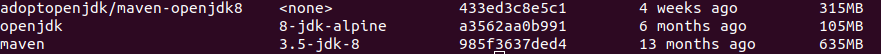

# Gestión Restaurante 

## Docker

Los micro servicios han sido containerizados con Dockerfiles. Para ver sus dockerfiles consulte los siguientes enlaces:
* [Mesas](https://github.com/antmordhar/ProyectoCC/blob/master/Mesas/Dockerfile)
* [Cocina](https://github.com/antmordhar/ProyectoCC/blob/master/Cocina/Dockerfile)
* [Camarero](https://github.com/antmordhar/ProyectoCC/blob/master/Camarero/Dockerfile)
* [APIService](https://github.com/antmordhar/ProyectoCC/blob/master/APIService/Dockerfile)

Sus contenedores son los siguientes:

Contenedor: https://hub.docker.com/r/antmordhar/projectccmesas .
Contenedor: https://hub.docker.com/r/antmordhar/projectcccocina .
Contenedor: https://hub.docker.com/r/antmordhar/projectcccamarero .
Contenedor: https://hub.docker.com/r/antmordhar/projectccapi .

Se ha creado la arquitectura de nuestro sistema usando un docker-compose. Para ver mas informacion sobre este pulse [aquí](https://github.com/antmordhar/ProyectoCC/blob/master/docker-compose.yml)

Con los siguientes comandos se puede crear, arrancar y parar nuestro sistema:
~~~shel
docker-compose build
docker-compose up
docker-compose down
~~~

Como imagen base para la construcción de la imagen del servicio se ha usado: https://hub.docker.com/r/adoptopenjdk/maven-openjdk8/ . En esa imagen se encuentra Maven y OpenJDK8 que son necesarios para la construcción y ejecución del proyecto.

Frente a esta imagen se compararon 2 más:

* https://hub.docker.com/r/rawmind/alpine-jdk8
* https://hub.docker.com/_/maven

Los pesos de las imágenes son los siguientes:

Como se puede ver el peso de Maven es demasiado elevado. Esto es por que contiene varias versiones de los JDK. Por otro lado OpenJDK8 Apline es más liviana pero hay que instalarle Maven por lo que dificulta el proceso. Por lo que se decidió usar alguna de las imagenes con maven instalado. Para decidirse se ha usado la herramienta [Apache HTTP server benchmarking tool](https://httpd.apache.org/docs/2.4/programs/ab.html) para medir el rendimiento de estas imágenes. Los resultados fueron los siguientes:

* **Maven**:
  * Tiempo de construcción: 8.519 s
  * Tiempo en responder 10000 peticiones: 5.681 s
  * Ratio de transeferencia: 249.24 Kbytes/sec
  
* **Maven-OpenJDK8**:
  * Tiempo de construcción: 7.771 s
  * Tiempo en responder 10000 peticiones: 5.059 s
  * Ratio de transeferencia: 279.91 Kbytes/sec

Como se puede ver, a parte de ser más liviano, Maven-OpenJDK8 nos da mejores tiempos en lo relativos a tiempo de construcción de la imagen, respuesta a las peticiones y en ratios de transferencia. Debido a esto, finalmente, se ha decidido Maven-OpenJDK8 como imagen base de nuestro servicio.

Finalmente la imagen del servicio pesa lo siguiente:

Para construir la imagen podemos usar uno de los siguientes comandos:

~~~shell
mvn dockerfile:build
~~~

* Usando el plugin de spotify Maven puede crear también la imagen del proyecto.

~~~shell
docker build --rm -f "Dockerfile" -t <nombreImagen>:<etiqueta> .
~~~

* La forma normal de hacerlo y la propuesta por la documentación de Docker. Por defecto la etiqueta que usa el latest.

Para probar la imagen en local podemos usar el siguiente comando:

~~~shell
docker run --rm -name <name> -network <net> -p <puerto>:<puerto> -d <nombreImagen>:<etiqueta>
~~~

* Comando completo propuesto por la documentación de Docker.

> Los comandos anteriores necesitan ser adaptados dependiendo del servicio con el que se quiera trabajar.

Además Docker Hub está configurado para que cada vez que se haga un push a nuestro repositorio, si pasa los tests de integración, se suba la imagen.

[Volver al Index](https://antmordhar.github.io/ProyectoCC/)