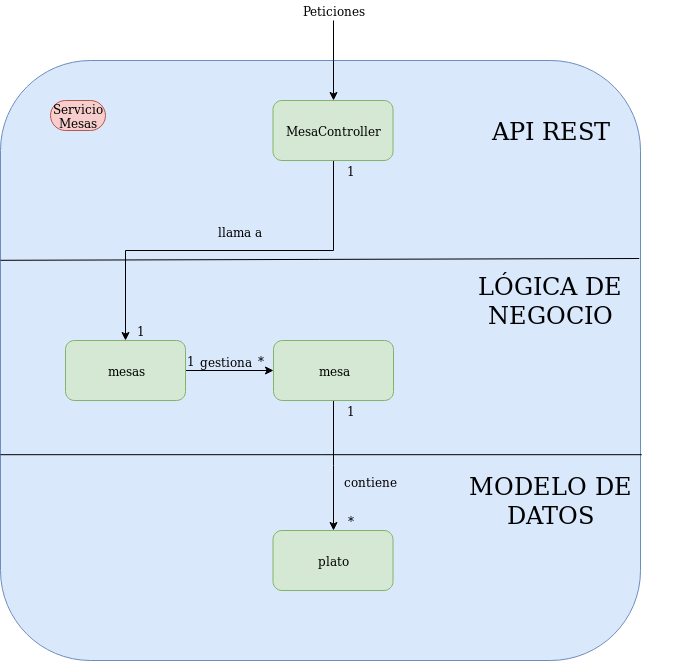

# Gestión Restaurante 

## Micro Servicio Mesas

Se ha implementado un microservicio el cual tiene una API REST. Este servicio estará desplegado usando un servidor embebido de [Tomcat 7](https://spring.io/blog/2014/03/07/deploying-spring-boot-applications#embedded-web-server-deployment) que nos proporciona Spring Boot. Los comandos las peticiones que se le pueden hacer son las siguientes:

* **GET: /pedido/{id}**
  * Muestra los pedidos de una mesa
* **POST: /pedido**
  * Para este comando es necesario pasarle un JSON como cuerpo con la siguiente estructura:

  ~~~ JSON
  "{"idmesa":0,
    "nombre":"plato0",
    "precio":1.4,
    "cantidad":1}"
  ~~~

  * Añade el pedido a la base de datos
* **POST: /pedido/send/{id}**
  * Envia una peticion a cocina por cada pedido que se encuentre guardado en una id. Cocina después se encargara de guardar los pedidos
  
* **DELETE: /pedido/{id}**
  * Borra todos los pedidos de una mesa

El microservicio cuenta con 4 clases:
  
* **app** : Es el main de nuestro micro servicio y la clase que lo ejecuta
* **mesasController** : Hace de API REST. Recibe las peticiones y llama al método correspondiente de la interfaz platoRepository.
* **platoRepository** : Realiza la inyección de dependencias. Es la interfaz encargada de realizar las operaciones en la base de datos. Extiende una clase propia de Spring que autoimplementa los metodos definidos en la interfaz.
* **plato** : Sirve como modelo para leer el cuerpo de JSON correspondiente a la petición hacer pedido. Tambien lo usa mongo como base para su coleción.

El microservicio está estructurado por capas como podemos ver en la siguiente imagen:

La capa de la API rest es la encargada de recibir las peticiones al micro servicio y enviar las respuestas que correspondan al exterior.
Por otro lado es la capa de la Lógica de Negocio la que se encarga se encarga de las operaciones con los datos, crearlos, almacenarlos, procesarlos, etc.
Por último la capa de Modelo de Datos contiene las estructuras que tomarán como base las datos en nuestro servicio.

[Volver al Index](https://antmordhar.github.io/ProyectoCC/)