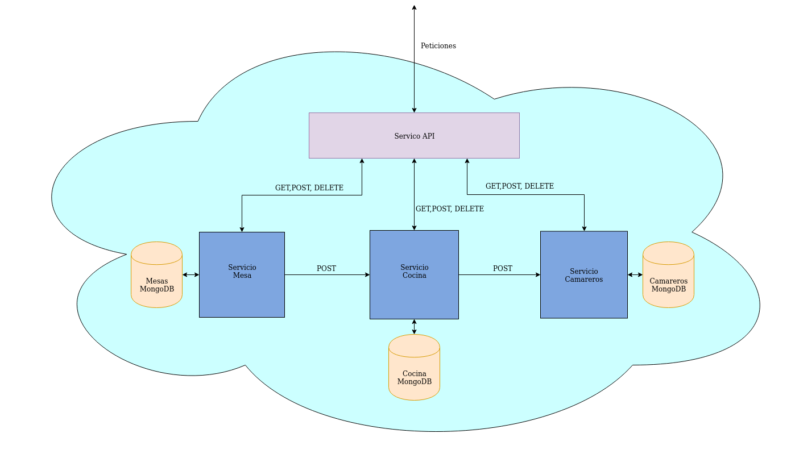

# Gestión Restaurante
[](https://www.gnu.org/licenses/gpl-3.0)
[](https://www.java.com/)
[](https://spring.io/)
[](https://travis-ci.org/antmordhar/ProyectoCC)
[](https://codecov.io/gh/antmordhar/ProyectoCC)
 
## 1. [Arquitectura](https://antmordhar.github.io/ProyectoCC/Documentacion/arquitectura)
## 2. [Tecnologías que se van a usar](https://antmordhar.github.io/ProyectoCC/Documentacion/tecnologias)
## 3. [Integración continua](https://antmordhar.github.io/ProyectoCC/Documentacion/integracion)
## 4. [Prerrequisitos](https://antmordhar.github.io/ProyectoCC/Documentacion/prerequisitos) 
## 5. [Herramienta de construcción](https://antmordhar.github.io/ProyectoCC/Documentacion/buildtool)
## 6. [Docker](https://antmordhar.github.io/ProyectoCC/Documentacion/docker)
## 7. [Heroku](https://antmordhar.github.io/ProyectoCC/Documentacion/heroku)
## 8. [Test de Prestaciones](https://antmordhar.github.io/ProyectoCC/Documentacion/TestdePrestaciones)
## 9. [Base de Datos](https://antmordhar.github.io/ProyectoCC/Documentacion/BasedeDatos)

## 10. Creación de la Máquina Virtual

Para crear la máquina virtual en local, que se usará para pasar los tests de carga, se ha descargado VirtualBox con las siguientes órdenes de comandos:

```
wget -q https://www.virtualbox.org/download/oracle_vbox_2016.asc -O- | sudo apt-key add -
wget -q https://www.virtualbox.org/download/oracle_vbox.asc -O- | sudo apt-key add -
sudo apt-get update
sudo apt-get install virtualbox

```
Depués de esto nos descargaremos [Vagrant](https://www.vagrantup.com/downloads.html) y lo instalaremos. Vagrant es una herramienta que nos permite construir y gestionar las máquinas virtuales facilmente.

Ahora se crea un archivo [Vagrantfile](./Vagrantfile). Nosotros usaremos la Vagrant Box de [ubuntu/disco64](https://app.vagrantup.com/ubuntu/boxes/disco64) que  usa VirtualBox como base y el sistema operativo de Ubuntu Server 19.04. Para crear este archivo utilizaremos el siguiente comando:

```
vagrant init ubuntu/disco64
```
Tras esto modificaremos el archivo que se nos crea. Cabe decir que lo más importante es el **mapeo de los puertos** de nuestro ordenador con los de la máquina virtual para poder acceder a nuestros servicios despues. Tambien se modificaran las **especificaciones bases de la Máquina de VirtuaBox** que servira de base que, en nuestro caso, tiene 2 nucleos y 2048 Mb de RAM. Este archivo se puede ver aquí: [Vagrantfile](./Vagrantfile)

Finalmente para correr la máquina virtual realizamos el siguiente comando:

```
vagrant up
```
Para pararla usaremos:
```
vagrant destroy
```

 ## 11. Aprovisionamiento de la Máquina Virtual
 Lo primero que se ha hecho es instalar Ansible con la siguiente orden:

 ```
 sudo apt install software-properties-common
 sudo apt install ansible
 ```

 Ansible es una herramienta de automatización open source que se usa para tareas de IT como gestion de la configuración, despliegue de aplicaciones, orquestacion y aprovisionamiento.

 Despues en el [Vagrantfile](./Vagrantfile) le especificamos el archivo que tiene que usar para aprovisionarse al arrancar. Así como el archivo de [Inventario](./provisioning/hosts.ini) que va a usar nuestra máquina.

 ```
  config.vm.provision "ansible" do |ansible|
    ansible.playbook = "./provisioning/provision.yml"
    ansible.inventory_path="./provisioning/hosts.ini"
  end
 ```

 Ahora, en [provision.yml](./provisioning/provision.yml), especificaremos todo lo que necesita la máquina para arrancar nuestro servicio. Para ver lo que usa esta máquina como aprovisionamiento visite: [provision.yml](./provisioning/provision.yml). Los host con los que trabajará este archivo se encuentran en : [hosts.ini](./provisioning/host.ini).

 >Resumen del archivo: Usa un rol de otro usuario para instalar Docker y Docker Compose. Tras esto copia los archivos [docker-compose](./provisioning/docker-compose.yml) y [.env](./provisioning/.env) en ella. Finalmente lanza la orden Docker Compose Up Para lanzar los servicios dentro de la máquina virtual.

 ## 12. Test de Prestaciones de Las Máquinas virtuales

 Prestaciones: testvacio.yml

 En este apartado intentaremos mejorar todo lo posible el rendimiento en las máquinas virtuales, para ello aplicaremos los test de cargas del [Test de Prestaciones](https://antmordhar.github.io/ProyectoCC/Documentacion/TestdePrestaciones) sobre ellas. 

 Se realizarán una serie de experimentos en local con 10 usuarios concurrentes. El escenario de Taurus que se usará será el de la prueba de todos los servicios ya que es la medida de las prestaciones más interesante sobre nuestros microservicios.
 
 Estas pruebas se van a dividir en 2 módulos:

 * En el **primer Módulo** se modificará el número de Cores y cantidad de memoria Ram de la máquina virtual y se decidirá una configuración.
 * En el **segundo Módulo** se probarán diferentes SO sobre la configuración elegida para conseguir optimizar los Hits/s

Las pruebas se realizarán sobre la siguiente arquitectura:



## 12.1 Experimentos Con Cores y RAM
Para los experimentos de esta sección se han probado 3 configuraciones de la máquina virtual:
* **1 Core 1024MB RAM**

* **2 Cores 2048MB RAM**

* **4 Cores 4096MB RAM**


Como hemos podido comprobar por las imágenes de arriba la mejor configuración para **la máquina virtual se alcanza con 2 Cores y 2048 MB**. La razón de esto es que con 1 solo core no hay hebras necesarias para levantar todos los microservicios y con 4 cores no hay mejora respecto de 2 cores y además realentíza la máquina que sirve como Host de la virtual.

## 12.2 Experimentos Con Sistemas Operativos

En este apartado probaremos diferentes SO en la máquina virtual para comprobar si se puede conseguir una mejora sustancial en comparación al actual(Ubuntu Server 19.04). Principalmente se probará sobre Imágenes de Ubuntu Server debido a que ofrecen la mayor compatibilidad con las tecnologías que se están usando. Las pruebas se realizarán contra la máquina virtual con la configuración elegida en el apartado anterior.

* **Ubuntu Server 12.04**

No compatible.
* **Ubuntu Server 14.04**

No compatible.
* **Ubuntu Server 16.04**

* **Ubuntu Server 18.04**

* **Ubuntu Server 19.04**

* **Ubuntu Server 19.10**

No compatible.

Aquí se han realizado pruebas con las diferentes versiones de Ubuntu Server. Las versiones más antiguas y más nuevas tienen problemas de compatibilidad con el Rol usado para instalar Docker y Docker Compose por lo que se han descartado. De las versiones funcionales, **la mas rapida es Ubuntu Server 16**. Por lo que se cambiara la Versión del SO de la máquina virtual a ubuntu/xenial64.

## 12.3 Resultados Finales

Las últimas pruebas se realizaran sobre todos los microservicios, tanto en conjunto como por separado. **La máquina virtual estará configurada con 2 Cores, 2048 MB de RAM y Con el SO de Ubuntu Server 16.**

* **Mesas**

* **Cocina**

* **Camarero**

* **Todos**


Como conclusión podemos comprobar como el hecho de haber virtualizado los microservicios dentro de una máquina virtual baja las prestaciones de las máquinas virtuales en torno a un 30% en local. 

 * Peticiones por segundo media 695 Hits/s
 * Ancho de banda medio 121 KiB/s
 * Tiempo de respuesta medio 14 ms
 * Error medio 0%

Pese a ello se ha intentado minimizar la perdida de rendimiento lo máximo posible con los recursos que se tenían en la máquina host:

* Intel(R) Core(TM) i7-5700HQ CPU @ 2.70GHz
* 8GB DDR3 1600MT/s Kingston MSI16D3LS1MNG/8G

## 13 Despliegue en Azure

URL:[restaurant.westeurope.cloudapp.azure.com](http://restaurant.westeurope.cloudapp.azure.com:8069/)

Para finalizar el proyecto se va a proceder al despliegue de la máquina virtual creada en Azure. Para ello comenzaremos creando una cuenta en azure. Después instalaremos el plugin vagran-azure para poder desplegar nuestra máquina virtual en azure:

```
vagrant plugin install vagrant-azure
```

Tras esto instalaremos Azure-CLI que nos permitirá ejecutar la linea de comandos de Azure en nuestra máquina:

```
sudo apt-get update
sudo apt-get install ca-certificates curl apt-transport-https lsb-release gnupg
curl -sL https://packages.microsoft.com/keys/microsoft.asc | 
    gpg --dearmor | 
    sudo tee /etc/apt/trusted.gpg.d/microsoft.asc.gpg > /dev/null
AZ_REPO=$(lsb_release -cs)
echo "deb [arch=amd64] https://packages.microsoft.com/repos/azure-cli/ $AZ_REPO main" | 
    sudo tee /etc/apt/sources.list.d/azure-cli.list
sudo apt-get update
sudo apt-get install azure-cli
```

Ahora necesitamos modificar el [Vagrantfile](./Vagrantfile) para que se conecte con azure. Para más información se puede consultar el [Vagrantfile](./Vagrantfile).

> Resumen del archivo: Se han puesto todas las variables necesaria para conexion con Azure así como la clave privada para conectarnos por SSH. Se ha especificado que se use de imagen Ubuntu 16.04. Se ha establecido una máquina con 2 cores y 4Gb de RAM. De estas se han abierto los puertos del 8000 al 9000. Finalmente se aprovisiona con Ansible.

Para subir esta máquina a Azure solo hay que hacer:

```
vagrant up
```
> Si se quisiera volver a la versión local solo se necesitaría comentar la versión de Azure y descomentar la local.

## 14 Test de Prestaciones de Azure

Finalmente, en este apartado, Hacemos un pequeño tests de carga sobre nuestra máquina virtual desplegada en azure. Estos tests se pasaran con 10 usuarios sobre la máquina especificada en el apartado anterior.

* **Mesas**

* **Cocina**

* **Camarero**

* **Todos**


Como podemos ver la velocidad ha caido de manera drástica. Esto se puede deber a la distancia del servidor y/o a las características de la máquina. La hipotesis que manejo es que el servidor esta capado para evitar ataques de denegación de servicio. Para ver los resultados del test de la máquina virtual vea el **apartado 12**. 

## Anexo: Cambios en el proyecto:

### Anexo.5 Herramienta de Construcción
buildtool: Makefile

* Creada regla para arrancar la máquina virtual y provisionarla: 
* make vagrant 
* make devagrant

### Anexo.X Contenedores docker

Contenedor: https://hub.docker.com/r/antmordhar/projectccmesas .

Contenedor: https://hub.docker.com/r/antmordhar/projectcccocina .

Contenedor: https://hub.docker.com/r/antmordhar/projectcccamarero .

Contenedor: https://hub.docker.com/r/antmordhar/projectccapi .

 
[Volver al Index](https://antmordhar.github.io/ProyectoCC/)
 
 

