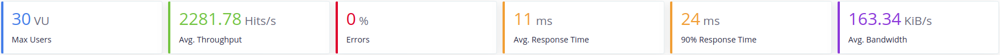

# Gestión Restaurante 

## 1. [Arquitectura](https://antmordhar.github.io/ProyectoCC/Documentacion/arquitectura)
## 2. [Tecnologías que se van a usar](https://antmordhar.github.io/ProyectoCC/Documentacion/tecnologias)
## 3. [Integración continua](https://antmordhar.github.io/ProyectoCC/Documentacion/integracion)
## 4. [Prerrequisitos](https://antmordhar.github.io/ProyectoCC/Documentacion/prerequisitos)  
## 5. [Herramienta de construcción](https://antmordhar.github.io/ProyectoCC/Documentacion/buildtool)
## 6. [Docker](https://antmordhar.github.io/ProyectoCC/Documentacion/docker)
## 7. [Heroku](https://antmordhar.github.io/ProyectoCC/Documentacion/heroku)

## 8 Test de Prestaciones

Recursos utilizados:
* Intel(R) Core(TM) i7-5700HQ CPU @ 2.70GHz
* Ubuntu 18.04.3 LTS

Para la medición de las prestaciones de nuestro sistema se ha usado [Taurus](https://gettaurus.org/). Taurus es una herramientra open source que nos permite pasar tests con JMeter,Selenium y otras herramientas facilmente. Para ello solo es necesario la creación de un fichero yml donde se encontrarán las instrucciones para la ejecución del test.

En nuestro caso usaremos JMeter como herramienta para pasar los tests a nuestros servicios. Los ficheros yml creados para los tests son los siguientes:

Prestaciones: ./TestsConexion/test.yml
Prestaciones: ./TestsConexion/testcamarero.yml
Prestaciones: ./TestsConexion/testcocina.yml
Prestaciones: ./TestsConexion/testmesas.yml

### 8.1 Estado inicial del Servicio Mesas
[Volver al Index](https://antmordhar.github.io/ProyectoCC/)
En la siguiente imagen podemos ver el resultado que el servicio mesas obtuvo al pasar el test que carga el servicio con peticiones de 10 usuarios durante 1 minuto con el servidor de **Tomcat7** embebido que proporciona Spring:

A continuacion veremos como el ancho banda del servidor Tomcat capa a 1.1MB mas o menos.

* **Tomcat**

Para intentar conseguir una mejora de las prestaciones cambiaremos el servidor predeterminado de Spring, Tomcat7 por otros y veremos la carga que soportan:

* **Jetty**

Podemos ver como Jetty da un mejor rendimiento con altas cargas de trabajo, pero e cuesta mas arrancar al principio.

* **Undertow**

Como podemos ver Undertow tiene un buen rendimiento en el arranque, sin embargo se realentiza con cargas altas de usuarios

* **Reactor Netty**

Reactor Netty tiene un alto rendimiento con cargas bajas de usuarios y un rendimiento alto con altas cargas. Sin embargo tarda algo mas en llegar a su tope de ancho de banda.

Con estos resultados delante podríamos aventurarnos a decir que Reactor Netty es el mayor competidor de Tomcat en terminos de velocidad y aguante de carga. Sin embargo estos resultados estan en local y sin bases de datos. A continuación se procede a la realización de las mismas pruebas con el estado del proyecto actual. 

### 8.2 Estado actual del proyecto

Para estas pruebas, los servicios han sido containerizados con Docker y se ha implementado la conexión con las base de datos, las cuales tambien se encuentran en un contenedor Docker. Ademas se ha establecido una conexión entre ellos mediante REST para poder simular con la maxima fidelidad, que podemos alcanzar actualmente, el proceso de trabajo que realizarían entre ellos.
El estado actual del proyecto se puede ver en la siguiente imagen:

El despliegue de las imagenes y, por tanto, pruebas de carga sera realizado en local. Las pruebas se realizarán con 10, 20 y 30 usuarios respectivamente para cada servicio con cada servidor. Esto es debido a que la velocidad al usar las bases de datos se reduce. En un primer momento se uso una única base de datos para todos los servicio, pero para ajustarnos mas a la arquitectura inicial del sistema y aumentar la velocidad de este actualmente se usa una por servicio.

* **Tomcat**
  * Mesas

cion/pic/mt30.png)
  * Cocina

  * Camarero

  * Todos

  * Resultados
    * Peticiones por segundo media 1286 Hits/s
    * Ancho de banda medio 225 KiB/s
    * Tiempo de respuesta medio 13 ms
    * Error medio 0%
* **Jetty**
  * Mesas

  * Cocina

  * Camarero

  * Todos

  * Resultados
    * Peticiones por segundo media 1393 Hits/s
    * Ancho de banda medio 111 KiB/s
    * Tiempo de respuesta medio 13 ms
    * Error medio 0%
* **Undertow**
  * Mesas

  * Cocina

  * Camarero

  * Todos

  * Resultados
    * Peticiones por segundo media 1459 Hits/s
    * Ancho de banda medio 195 KiB/s
    * Tiempo de respuesta medio 13 ms
    * Error medio 0%
* **Reactor Netty**
  * Mesas

  * Cocina

  * Camarero

  * Todos

  * Resultados
    * Peticiones por segundo media 1428 Hits/s
    * Ancho de banda medio 119 KiB/s
    * Tiempo de respuesta medio 13 ms
    * Error medio 0%

* **Discusion**
  
Como podemos ver al usar la base de datos, los servidores, son hasta 6 veces mas lentos de media que en las versiones previas.

El servicio camarero es mas rápido que los demas servicios debido a que este no necesita mandar peticiones a ningun otro servicio, es totalmente independiente. Por lo que es una buena muestra de la velocidad que tendría un servicio por si solo en los diferentes servidores.

Al hacer el test de carga a todos los servicios a la vez se puede ver una clara disminución de la velocidad de respuesta del servidor tardando hast el doble por petición.

Finalmente atendiendo a los resultados obtenidos:
* Tomcat
  * Peticiones por segundo media 1286 Hits/s
  * Ancho de banda medio 225 KiB/s
  * Tiempo de respuesta medio 13 ms
  * Error medio 0% 
* Jetty
  * Peticiones por segundo media 1393 Hits/s
  * Ancho de banda medio 111 KiB/s
  * Tiempo de respuesta medio 13 ms
  * Error medio 0%
* Undertow[Volver al Index](https://antmordhar.github.io/ProyectoCC/)
  * Peticiones por segundo media 1459 Hits/s
  * Ancho de banda medio 195 KiB/s
  * Tiempo de respuesta medio 13 ms
  * Error medio 0%
* Reactor Netty
  * Peticiones por segundo media 1428 Hits/s
  * Ancho de banda medio 119 KiB/s
  * Tiempo de respuesta medio 13 ms
  * Error medio 0%

Podemos ver como. el tiempo de respuesta y la tasa de error que nos proporcionan todos los servidores es la misma.(Los decimales han sido omitidos). Por lo que para la eleccion del servidor se ha atendido a las peticiones por segundo aceptadas y a su rendimiento al hacer los test de carga de todo el sistema al conjunto. Teniendo esto en cuenta los principales competidores son Reactor Netty y Undertow. Sin embargo Undertow ha demostrado una mejor competencia a la hora del tes de carga total, por lo que se ha elegido este finalmente. 

Java, al ser un lenguaje compilado, proporciona una mayor velocida que los lenguajes interpretados. Además los servidores embebidos que proporciona Spring Boot estan configurados por defecto para sacar un buen partido del servidor. Por ejemplo en nuestra eleccion final, undertow, esta configurado para que use todos los procesadores que esten disponibles y use 8 *workers threads* por cada procesador. Además usará toda la memora que este disponible para la Java Virtual Machine.

Finalmeten en cuanto a la base de datos, Mongo, como hemos comentado anteriormente se desplego 3 veces, una base de datos para cada servicio. Cosa que, consecuentemente, aceleró la respuesta de peticiones del sistema.

## 9. Base de Datos

Como bases de datos para los microservicios se ha usado **MongoDB**. 

Para la inyeccion de dependencias se ha usado una interfaz que extiende  **Spring Data Mongo Repository**. Esto proporciona todas los metodos CRUD para trabajar con nuestro modelo *plato*. Además "autoimplementa" los metodos que declares en la interfaz en dependencia de su nombre y el objeto que devuelvan. Para realizar esto se parsea el nombre del metodo que declaremos buscando el nombre de las variables de nuestro modelo y de un conjunto de reglas que forman las queries.

Para trabajar con el el repositorio solo hace falta realizar la inyección de dependencias en la clase que lo necesite. Esto se lleva a cabo con la anotación **@Autowired** que instanciará el repositorio al arrancar el servicio. Para realizar la comunicación con la base de datos tenemos que llamar a los métodos que hayamos declarado en el repositorio o a los que ya vienen implementados por defecto.

Para mas información:

* [Documentación Spring Mongo Repository](https://docs.spring.io/spring-data/mongodb/docs/current/reference/html/#mongo.repositories)
* [Repositorio para platos](https://github.com/antmordhar/ProyectoCC/blob/master/Mesas/src/Mesas/platosRepository.java)
* [Clase con injección de dependencias](https://github.com/antmordhar/ProyectoCC/blob/master/Mesas/src/Mesas/mesaController.java)
---

[Volver al Index](https://antmordhar.github.io/ProyectoCC/)

