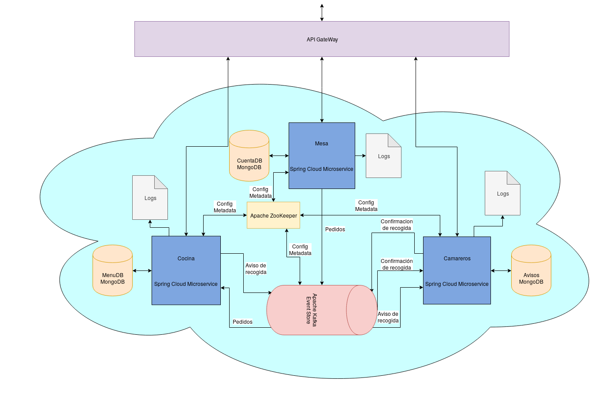

# Proyecto
## Gestión Restaurante

La idea básica de este microservicio es ayudar a la gestión de las comandas en un restaurante.
Para ello se van a crear 3 **microservicios**:

* **Mesas:**  Este servicio podrá ser usado a través de la ApiGateway y se le deberá pasar la comanda en forma de Json. Las mesas serán las encargadas de **enviar** esta comanda a **Cocina**. Además, también tendrán un **control de los pedidos** de los clientes en una base de datos.

* **Cocina:** Este microservicio podrá ser usado a través de la ApiGateway de dos maneras.
    * Para **solicitar el Menú**, que será devuelto en forma de Json.
    * Para **avisar** a los **Camareros** de que una comanda está lista.

    El servicio contara con una base de datos en la que se guardara el menú.

* **Camareros:** Su objetivo es **recibir los avisos** de las comandas que salen de **Cocina**. Para avisar de que una comanda ya ha sido atendida se podrá usar la ApiGateway y **mandar un aviso** a todos los **camareros**.

Su **arquitectura** se correspondería con la siguiente **imagen**:

La arquitectura esta basada en una arquitectura **dirigida por eventos**. Los microservicios se comunicarán entre ellos a través del **EventStore** y con el exterior a traves del **ApiGateway**

La elección de esta arquitectura esta movida por la filosofía básica de trabajo en un bar o restaurante. 
* Las **mesas** generarían las comandas, que serían los **eventos**. 
* Después como **consumidor** de estos eventos estaría la **cocina**. Esta intenta dar respuesta a las comandas que le entran tan rápido como le es posible.
* Por último estarían los **camareros**, los cuales se encargan de comunicar a las mesas con la cocina como si del **MessageBroker** se tratara.

Como podemos ver la arquitectura dirigida por eventos encaja de manera casi perfecta en el funcionamiento del previamente mencionado bar o restaurante.

Un **caso de uso** sería:

>Las **mesas** usan la ApiGateway para pedir el menú. Tras esto, envían la comanda a través del ApiGateway. Tras esto se avisa a **cocina** y comienza a resolver la comanda. Una vez resulta la **cocina** usa la ApiGateway para generar un aviso a los **camareros**. El primer camarero libre usa la ApiGateway para avisar al resto de **camareros** de que ya se esta llevando la comanda y lleva la comanda a la **mesa** que la pidió.

Finalmente se deja abierta la **conexión a otros servicios**, como un procesador de pagos,  para gestionar los pagos que se guardaron en la mesa.

Como **lenguajes**: 
* Para la creación de microservicios se usará **Java** junto con los frameworks **Spring Boot** y **Spring Cloud**. 
* Para el manejador de eventos se usará **Apache Kafka**.
* Para la configuración distribuida se usará **Apache ZooKeeper**
* Para las bases de datos se usará **MongoDB**.
* Para la comunicación con el **ApiGateway** se usarán peticiones **HTTP**.
* Y por último se usara **Json** para el envio de información en las comuniciones.

[Volver al Index](https://antmordhar.github.io/ProyectoCC/)