# Gestión Restaurante 

## 1. [Arquitectura](https://antmordhar.github.io/ProyectoCC/Documentacion/arquitectura)
## 2. [Tecnologías que se van a usar](https://antmordhar.github.io/ProyectoCC/Documentacion/tecnologias)
## 3. [Integración continua](https://antmordhar.github.io/ProyectoCC/Documentacion/integracion)
## 4. [Prerrequisitos](https://antmordhar.github.io/ProyectoCC/Documentacion/prerequisitos)  
## 5. [Herramienta de construcción](https://antmordhar.github.io/ProyectoCC/Documentacion/buildtool)
## 6. [Docker](https://antmordhar.github.io/ProyectoCC/Documentacion/docker)
## 7. [Heroku](https://antmordhar.github.io/ProyectoCC/Documentacion/heroku)

## 8 Test de Prestaciones

Para la medición de las prestaciones de nuestro sistema se ha usado [Taurus](https://gettaurus.org/). Taurus es una herramientra open source que nos permite pasar tests con JMeter,Selenium y otras herramientas facilmente. Para ello solo es necesario la creación de un fichero yml donde se encontrarán las instrucciones para la ejecución del test.

En nuestro caso usaremos JMeter como herramienta para pasar los tests a nuestros servicios. Los ficheros yml creados para los tests son los siguientes:

Prestaciones: ./TestsConexion/test.yml
Prestaciones: ./TestsConexion/testcamarero.yml
Prestaciones: ./TestsConexion/testcocina.yml
Prestaciones: ./TestsConexion/testmesas.yml

### 8.1 Estado inicial del Servicio Mesas

En la siguiente imagen podemos ver el resultado que el servicio mesas obtuvo al pasar el test que carga el servicio con peticiones de 10 usuarios durante 1 minuto con el servidor de **Tomcat7** embebido que proporciona Spring:

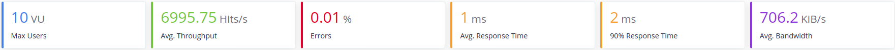

A continuacion veremos como el ancho banda del servidor Tomcat capa a 1.1MB mas o menos.

* **Tomcat**
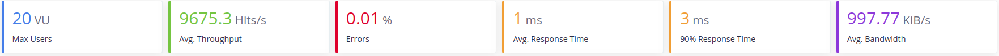
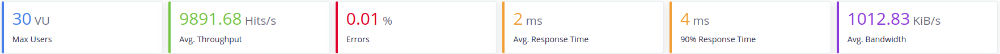
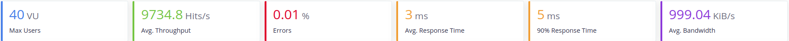
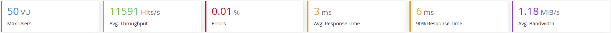
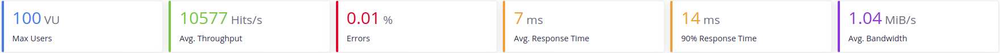
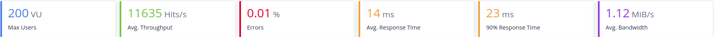

Para intentar conseguir una mejora de las prestaciones cambiaremos el servidor predeterminado de Spring, Tomcat7 por otros y veremos la carga que soportan:

* **Jetty**
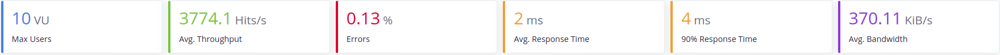
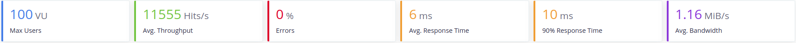
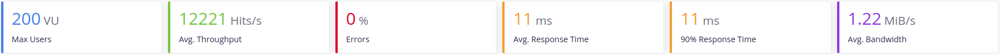

Podemos ver como Jetty da un mejor rendimiento con altas cargas de trabajo, pero e cuesta mas arrancar al principio.

* **Undertow**
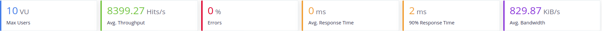
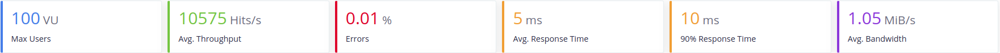
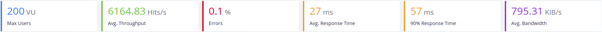

Como podemos ver Undertow tiene un buen rendimiento en el arranque, sin embargo se realentiza con cargas altas de usuarios

* **Reactor Netty**
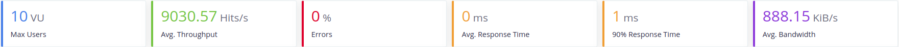
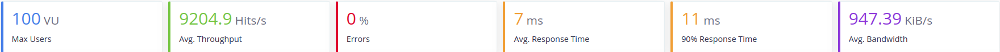
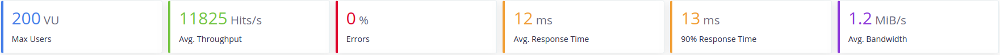

Reactor Netty tiene un alto rendimiento con cargas bajas de usuarios y un rendimiento alto con altas cargas. Sin embargo tarda algo mas en llegar a su tope de ancho de banda.

Con estos resultados delante podríamos aventurarnos a decir que Reactor Netty es el mayor competidor de Tomcat en terminos de velocidad y aguante de carga. Sim embargo estos resultados estan en local y sin bases de datos. A continuación se procede a la realización de las mismas pruebas con el estado del proyecto actual. 

### 8.2 Estado actual del proyecto

Para estas pruebas, los servicios han sido containerizados con Docker y se ha implementado la conexión con las base de datos, las cuales tambien se encuentran en un contenedor Docker. Ademas se ha establecido una conexión entre ellos mediante REST para poder simular con la maxima fidelidad, que podemos alcanzar actualmente, el proceso de trabajo que realizarían entre ellos.
El estado actual del proyecto se puede ver en la siguiente imagen:

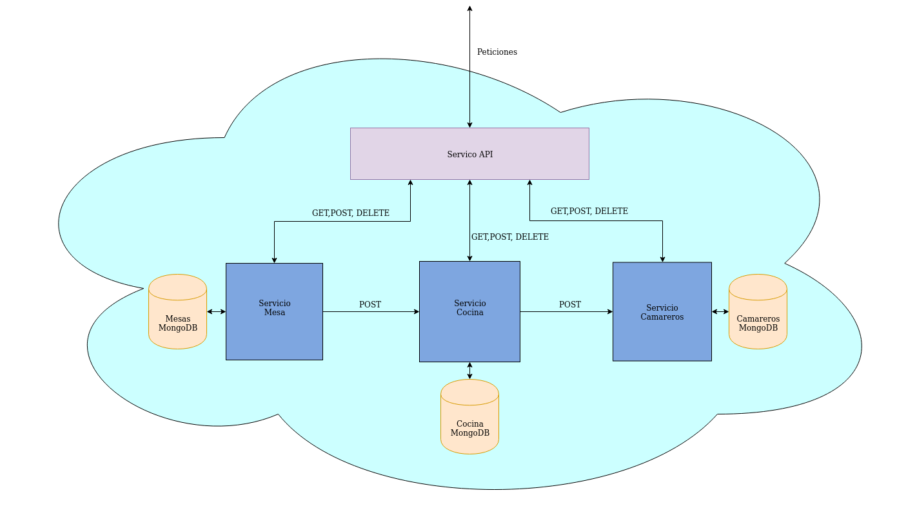

El despliegue de las imagenes y, por tanto, pruebas de carga sera realizado en local. Las pruebas se realizarán con 10, 20 y 30 usuarios respectivamente para cada servicio con cada servidor. Esto es debido a que la velocidad al usar las bases de datos se reduce. En un primer momento se uso una única base de datos para todos los servicio, pero para ajustarnos mas a la arquitectura inicial del sistema y aumentar la velocidad de este actualmente se usa una por servicio.

* **Tomcat**
  * Mesas
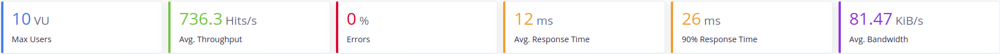
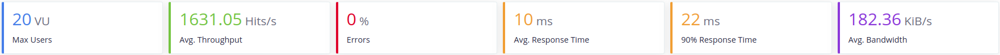
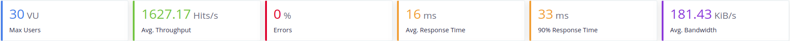
  * Cocina
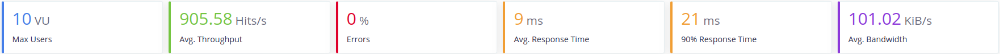
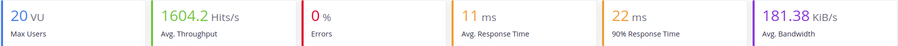
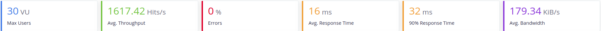
  * Camarero
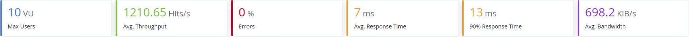

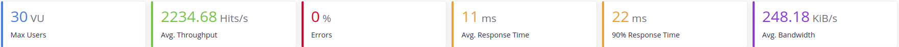
  * Todos
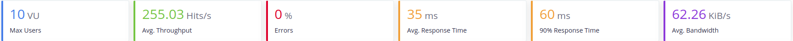
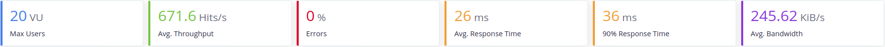
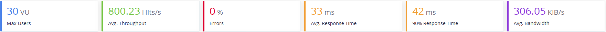
  * Resultados
    * Peticiones por segundo media 1286 Hits/s
    * Ancho de banda medio 225 KiB/s
    * Tiempo de respuesta medio 13 ms
    * Error medio 0%
* **Jetty**
  * Mesas
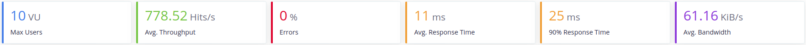

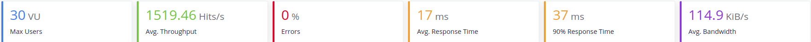
  * Cocina
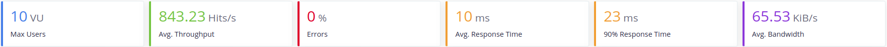
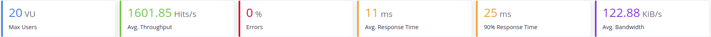
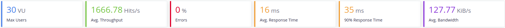
  * Camarero

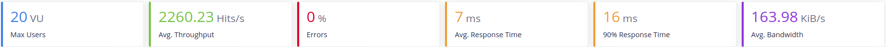
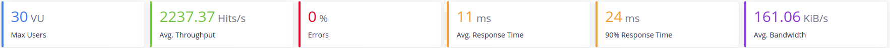
  * Todos
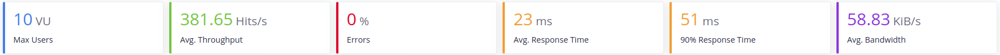
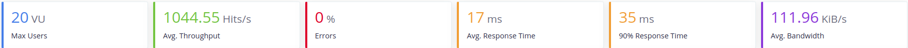
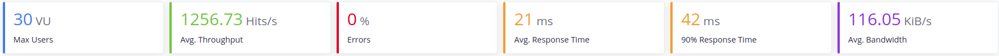
  * Resultados
    * Peticiones por segundo media 1393 Hits/s
    * Ancho de banda medio 111 KiB/s
    * Tiempo de respuesta medio 13 ms
    * Error medio 0%
* **Undertow**
  * Mesas
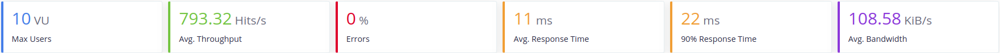
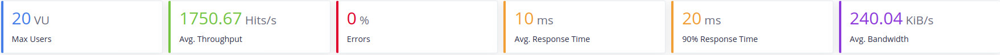
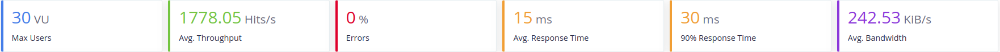
  * Cocina
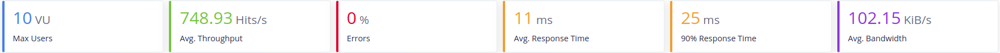
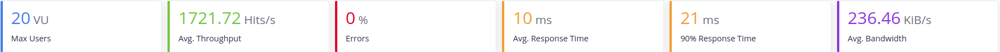
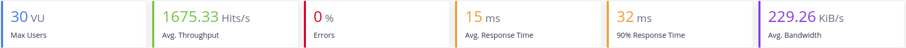
  * Camarero
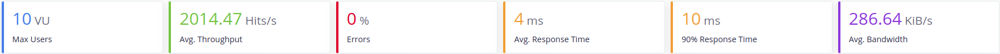
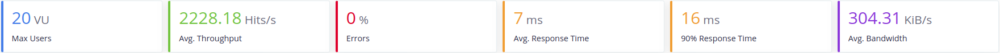
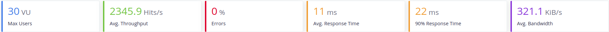
  * Todos
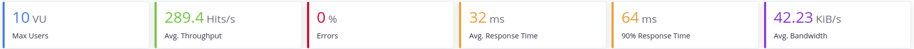
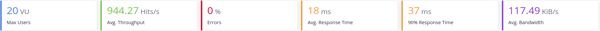
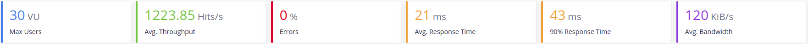
  * Resultados
    * Peticiones por segundo media 1459 Hits/s
    * Ancho de banda medio 195 KiB/s
    * Tiempo de respuesta medio 13 ms
    * Error medio 0%
* **Reactor Netty**
  * Mesas

  * Cocina

  * Camarero

  * Todos

  * Resultados
    * Peticiones por segundo media 1428 Hits/s
    * Ancho de banda medio 119 KiB/s
    * Tiempo de respuesta medio 13 ms
    * Error medio 0%

* **Discusion**
    * Como podemos ver al usar la base de datos, los servidores, son hasta 6 veces mas lentos de media que en las versiones previas. 
    * El servicio camarero es mas rápido que los demas servicios debido a que este no necesita mandar peticiones a ningun otro servicio, es totalmente independiente. Por lo que es una buena muestra de la velocidad que tendría un servicio por si solo en los diferentes servidores.
    * Al hacer el test de carga a todos los servicios a la vez se puede ver una clara disminución de la velocidad de respuesta del servidor tardando hast el doble por petición.
    * (QUEDA RAZONAR POR QUE NO HAY ERRORES)
    * (QUEDA DECIR QUE SERVIDOR HA TENIDO LOS MEJORES RESULTADOS)
  
[Volver al Index](https://antmordhar.github.io/ProyectoCC/)

