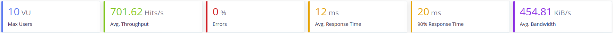

# Gestión Restaurante

 
## 1. [Arquitectura](https://antmordhar.github.io/ProyectoCC/Documentacion/arquitectura)
## 2. [Tecnologías que se van a usar](https://antmordhar.github.io/ProyectoCC/Documentacion/tecnologias)
## 3. [Integración continua](https://antmordhar.github.io/ProyectoCC/Documentacion/integracion)
## 4. [Prerrequisitos](https://antmordhar.github.io/ProyectoCC/Documentacion/prerequisitos) 
## 5. [Herramienta de construcción](https://antmordhar.github.io/ProyectoCC/Documentacion/buildtool)
## 6. [Docker](https://antmordhar.github.io/ProyectoCC/Documentacion/docker)
## 7. [Heroku](https://antmordhar.github.io/ProyectoCC/Documentacion/heroku)
 
## 8 Test de Prestaciones
 
Recursos utilizados:
* Intel(R) Core(TM) i7-5700HQ CPU @ 2.70GHz
* Ubuntu 18.04.3 LTS
 
Para la medición de las prestaciones de nuestro sistema se ha usado [Taurus](https://gettaurus.org/). Taurus es una herramienta open source que nos permite pasar tests con JMeter,Selenium y otras herramientas fácilmente. Para ello solo es necesario la creación de un fichero yml donde se encontrarán las instrucciones para la ejecución del test.
 
En nuestro caso usaremos JMeter como herramienta para pasar los tests a nuestros servicios. Los ficheros yml creados para los tests son los siguientes:
 
Prestaciones: ./TestsConexion/test.yml
Prestaciones: ./TestsConexion/testcamarero.yml
Prestaciones: ./TestsConexion/testcocina.yml
Prestaciones: ./TestsConexion/testmesas.yml
 
### 8.1 Estado inicial del Servicio Mesas

En la siguiente imagen podemos ver el resultado que el servicio mesas obtuvo al pasar el test que carga el servicio con peticiones de 10 usuarios durante 1 minuto con el servidor de **Tomcat7** embebido que proporciona Spring:
 

 
A continuación veremos como el ancho banda del servidor Tomcat capa a 1.1MB mas o menos.
 
* **Tomcat**

 
Para intentar conseguir una mejora de las prestaciones cambiaremos el servidor predeterminado de Spring, Tomcat7 por otros y veremos la carga que soportan:
 
* **Jetty**

 
Podemos ver como Jetty da un mejor rendimiento con altas cargas de trabajo, pero le cuesta más arrancar al principio.
 
* **Undertow**

 
Como podemos ver Undertow tiene un buen rendimiento en el arranque, sin embargo se ralentiza con cargas altas de usuarios
 
* **Reactor Netty**

 
Reactor Netty tiene un alto rendimiento con cargas bajas de usuarios y un rendimiento alto con altas cargas. Sin embargo tarda algo más en llegar a su tope de ancho de banda.
 
Con estos resultados delante podríamos aventurarnos a decir que Reactor Netty es el mayor competidor de Tomcat en términos de velocidad y aguante de carga. Sin embargo estos resultados están en local y sin bases de datos. A continuación se procede a la realización de las mismas pruebas con el estado del proyecto actual.
 
### 8.2 Estado actual del proyecto
 
Para estas pruebas, los servicios han sido containerizados con Docker y se ha implementado la conexión con las base de datos, las cuales también se encuentran en un contenedor Docker. Además se ha establecido una conexión entre ellos mediante REST para poder simular con la máxima fidelidad, que podemos alcanzar actualmente, el proceso de trabajo que realizan entre ellos.
El estado actual del proyecto se puede ver en la siguiente imagen:
 

 
El despliegue de las imágenes y, por tanto, pruebas de carga será realizado en local. Las pruebas se realizarán con 10, 20 y 30 usuarios respectivamente para cada servicio con cada servidor. Esto es debido a que la velocidad al usar las bases de datos se reduce. En un primer momento se usó una única base de datos para todos los servicio pero,  para ajustarnos más a la arquitectura inicial del sistema y aumentar la velocidad de éste, actualmente se usa una por servicio.
 
* **Tomcat**
 * Mesas

 * Cocina

 * Camarero

 * Todos

 * Resultados
   * Peticiones por segundo media 1286 Hits/s
   * Ancho de banda medio 225 KiB/s
   * Tiempo de respuesta medio 13 ms
   * Error medio 0%
* **Jetty**
 * Mesas

 * Cocina

 * Camarero

 * Todos

 * Resultados
   * Peticiones por segundo media 1393 Hits/s
   * Ancho de banda medio 111 KiB/s
   * Tiempo de respuesta medio 13 ms
   * Error medio 0%
* **Undertow**
 * Mesas

 * Cocina

 * Camarero

 * Todos

 * Resultados
   * Peticiones por segundo media 1459 Hits/s
   * Ancho de banda medio 195 KiB/s
   * Tiempo de respuesta medio 13 ms
   * Error medio 0%
* **Reactor Netty**
 * Mesas

 * Cocina

 * Camarero

 * Todos

 * Resultados
   * Peticiones por segundo media 1428 Hits/s
   * Ancho de banda medio 119 KiB/s
   * Tiempo de respuesta medio 13 ms
   * Error medio 0%
 
* **Discusión**
 Como podemos ver al usar la base de datos, los servidores, son hasta 6 veces más lentos de media que en las versiones previas.
 
El servicio camarero es más rápido que los demás servicios debido a que este no necesita mandar peticiones a ningún otro servicio, es totalmente independiente. Por lo que es una buena muestra de la velocidad que tendría un servicio por sí solo en los diferentes servidores.
 
Al hacer el test de carga a todos los servicios a la vez se puede ver una clara disminución de la velocidad de respuesta del servidor tardando hast el doble por petición.
 
Finalmente atendiendo a los resultados obtenidos:
* Tomcat
  * Peticiones por segundo media 1286 Hits/s
  * Ancho de banda medio 225 KiB/s
  * Tiempo de respuesta medio 13 ms
  * Error medio 0%
* Jetty
  * Peticiones por segundo media 1393 Hits/s
  * Ancho de banda medio 111 KiB/s
  * Tiempo de respuesta medio 13 ms
  * Error medio 0%
* Undertow
  * Peticiones por segundo media 1459 Hits/s
  * Ancho de banda medio 195 KiB/s
  * Tiempo de respuesta medio 13 ms
  * Error medio 0%
* Reactor Netty
  * Peticiones por segundo media 1428 Hits/s
  * Ancho de banda medio 119 KiB/s
  * Tiempo de respuesta medio 13 ms
  * Error medio 0%
 
Podemos ver como. el tiempo de respuesta y la tasa de error que nos proporcionan todos los servidores es la misma.(Los decimales han sido omitidos). Por lo que para la elección del servidor se ha atendido a las peticiones por segundo aceptadas y a su rendimiento al hacer los test de carga de todo el sistema al conjunto. Teniendo esto en cuenta los principales competidores son Reactor Netty y Undertow. Sin embargo Undertow ha demostrado una mejor competencia a la hora del test de carga total, por lo que se ha elegido este finalmente.
 
Java, al ser un lenguaje compilado, proporciona una mayor velocidad que los lenguajes interpretados. Además los servidores embebidos que proporciona Spring Boot están configurados por defecto para sacar un buen partido del servidor. Por ejemplo en nuestra elección final, Undertow, está configurado para que use todos los procesadores que estén disponibles y use 8 *workers threads* por cada procesador. Además usará toda la memoria que esté disponible para la Java Virtual Machine.
 
Finalmente en cuanto a la base de datos, Mongo, como hemos comentado anteriormente, se desplegó 3 veces, para que haya una base de datos para cada servicio. Cosa que, consecuentemente, aceleró la respuesta de peticiones del sistema.
 
---
 
## 9. Base de Datos
 
Como bases de datos para los microservicios se ha usado **MongoDB**.
 
Para la inyección de dependencias se ha usado una interfaz que extiende  **Spring Data Mongo Repository**. Esto proporciona todas los métodos CRUD para trabajar con nuestro modelo *plato*. Además "auto implementa" los métodos que declares en la interfaz en dependencia de su nombre y el objeto que devuelvan. Para realizar esto se parsea el nombre del método que declaremos buscando el nombre de las variables de nuestro modelo y de un conjunto de reglas que forman las queries.
 
Para trabajar con el repositorio solo hace falta realizar la inyección de dependencias en la clase que lo necesite. Esto se lleva a cabo con la anotación **@Autowired** que instanciará el repositorio al arrancar el servicio. Para realizar la comunicación con la base de datos tenemos que llamar a los métodos que hayamos declarado en el repositorio o a los que ya vienen implementados por defecto. 
 
Para más información:
 
* [Documentación Spring Mongo Repository](https://docs.spring.io/spring-data/mongodb/docs/current/reference/html/#mongo.repositories)
* [Repositorio para platos](https://github.com/antmordhar/ProyectoCC/blob/master/Mesas/src/Mesas/platoRepository.java)
* [Clase con injección de dependencias](https://github.com/antmordhar/ProyectoCC/blob/master/Mesas/src/Mesas/mesaController.java)
 
---
 
## 10. Cambios en el proyecto:
 
### 10.1 Servicios:
 
* Se han implementado 3 nuevos servicios:
  * **Cocina**
    * Descripcion extendida [aquí](https://antmordhar.github.io/ProyectoCC/Documentacion/cocinaService).
  * **Camareros**  
    * Descripcion extendida [aquí](https://antmordhar.github.io/ProyectoCC/Documentacion/camareroService).
  * **API**
    * Descripcion extendida [aquí](https://antmordhar.github.io/ProyectoCC/Documentacion/APIService).
* Se ha eliminado el POM padre y se han establecido todos los servicios como proyectos independientes.
* Se ha hecho funcional el archivo application.properties de cada proyecto. En él se han establecido algunas configuraciones que se usarán cuando el servicio se ejecute en local, sin estar en una imagen.
* Se han creado los tests unitarios para todas las clases creadas.
* Se han adaptado los servicios para que puedan funcionar tanto en local como en imágenes de Docker mediante el uso de variables de entorno.
* Se ha cambiado el servidor embebido a Undertow. El razonamiento se puede ver en el apartado 8. Tests de prestaciones. El cambio se puede ver en el pom de cada proyecto. Por ejemplo [aquí](https://antmordhar.github.io/ProyectoCC/Mesas/pom.xml)
 
### 10.2 Integración continua
 
* Travis
 * Se han añadido los tests de los nuevos servicios a travis y su envío de la cobertura a codecov.
 * Ahora se levanta mongo al pasar los tests en travis.
 * Se han establecido las variables de entorno necesarias para el funcionamiento de los servicios.
 * Codecov juntara la cobertura total de los proyectos.
* GitHub Actions
 * Se han añadido los test de los nuevos servicio a GHA.
 * Ahora se levanta mongo al pasar los test de GHA.
 * Se ha eliminado los tests en MacOS y Windows por problemas de compatibilidad con mongo.
* Para mas información consulte el enlace a los archivos de configuración que se mencionan en: [Integración continua](https://antmordhar.github.io/ProyectoCC/Documentacion/integracion)
 
### 10.3 Herramienta de construcción
 
* Ahora se instala también mongo al realizar la primera instalación
* Se ha eliminado los antiguos tests de conexión y se han sustituido por el test de carga.
* Se ha cambiado la forma de creación, arranque y parada de las imágenes de Docker. Ahora se realizan con el docker compose.
* Se ha quitado el testeo de la regla de empaquetado del servicio.
* Se han añadido el testeo de todos los servicios por separado. Además se levantarán y pararan bases de datos y otros servicios necesarios para los test unitarios.
* Se ha adaptado todas las funcionalidades del make a la nueva estructura del proyecto.
* Para mas información consulte: [Herramienta de construcción](https://antmordhar.github.io/ProyectoCC/Documentacion/buildtool)
 
### 10.4 Docker
 
* Se han contenerizado los servicios creados.
* Se ha eliminado el Docker Hub anterior y se ha sustituido por uno para cada proyecto.
* Ahora se necesitan usar las variables de entorno del URI de la base de datos y de los nombres de host con los que se conecta cada servicio.
* Se ha creado un docker-compose que nos crea y levanta todos los servicios y que crea una red para que los servicios puedan comunicarse.
* Las bases de datos de mongo se ejecutan en imagenes y tambien son levantadas al ejecutar el docker-compose
* Para mas datos consulte: [Docker](https://antmordhar.github.io/ProyectoCC/Documentacion/docker)
 
[Volver al Index](https://antmordhar.github.io/ProyectoCC/)
 
 

