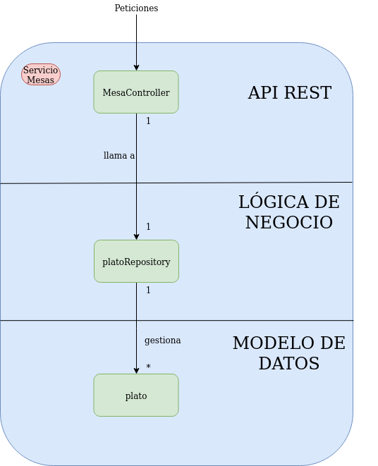

# Gestión Restaurante 

## Arquitectura
La idea básica de este microservicio es ayudar a la gestión de las comandas en un restaurante.
Para ello se van a crear 3 **microservicios**:

* **Mesas** 
* **Cocina** 
* **Camareros** 

Para ver una descripción extendida de la **arquitectura** pulse [aquí](https://antmordhar.github.io/ProyectoCC/Documentacion/arquitectura).

---
  
## Tecnologías que se van a usar

* **Java**
* **Spring Boot** 
* **Spring Cloud**
* **MongoDB**
* **Apache Kafka**
* **Apache ZooKeeper**

Para ver una descripción extendida de las **tecnologías** que se usan pulse [aquí](https://antmordhar.github.io/ProyectoCC/Documentacion/tecnologias).

---

## Integración continua

Para la integracion continua se usara **Travis-CI** y **GitHub-Actions**. 

Para ver mas información sobre la integración continua pulse [aquí](https://antmordhar.github.io/ProyectoCC/Documentacion/integracion)

---

## Prerrequisitos

Para el correcto funcionamiento del proyecto sera necesario tener:

* **OpenJDK 8**
* **Maven**

---
  
## Herramienta de construcción

buildtool: Makefile

Pese a estar usando **Maven** como herramienta de construcción principal se ha decidido usar Makefile para acortar y simplificar el uso de los comandos de Maven. Se han configurado 8 Objetivos:

~~~shell
make firstinstall
~~~

* Este comando instalará maven,openjdk-8-jdk y las dependencias del proyecto. Después pasará los tests unitarios.

~~~shell
make install
~~~

* Instalará solo las dependencias del proyecto y limpia las dependencias y archivos creados por builds anteriores en la carpeta /Proyecto/target. Tras esto pasara los tests unitarios.

~~~shell
make creardocker
~~~

* Ejecuta el comando para que se limpien los archivos creados por builds anteriores empaquete de nuevo la aplicación y cree la imagen del proyecto ejecutando el Dockerfile.

~~~shell
make correrdocker
~~~

* Ejecuta el comando para que corra la imagen creada con docker localmente en el puerto 8080.

~~~shell
make test
~~~

* Corre los tests unitarios y los de cobertura del código del proyecto. Si faltaran dependencias las instalará.

* Los test unitarios están desarrollados con **JUnit**. Maven usa **SureFire** para generar el reporte final de pasar los tests.
Por otra parte los tests de cobertura del código se pasan con **cobertura**. Tras pasarse los tests se podrán ver los resultados en:

  * **Unitarios**: /Proyecto/target/surefire-reports/
  * **Cobertura**: /Proyecto/target/site
  
~~~shell
make testcontenedor
~~~

* Corre un script que te crea el contenedor con el Dockerfiles y le realiza pruebas de conexión en local. Para más información sobre lo que hace el script pulse [aquí](https://github.com/antmordhar/ProyectoCC/blob/master/TestsConexion/docker.sh)

~~~shell
make testurl
~~~

* Corre un script que hace hace las peticiones al servicio desplegado en Heroku. Para ver que hace el script pulse [aquí](https://github.com/antmordhar/ProyectoCC/blob/master/TestsConexion/heroku.sh)

~~~shell
make clean
~~~

* Limpia las dependencias y archivos creados por builds anteriores en la carpeta /Proyecto/target

Para más información vea [Makefile](https://github.com/antmordhar/ProyectoCC/blob/master/Makefile)

---

## Micro Servicio Mesas

Se ha implementado un microservicio el cual tiene una API REST. Los comandos las peticiones que se le pueden hacer son las siguientes:

* **GET: /verpedido/{id}**
  * Muestra los pedidos de una mesa
* **POST: /crearmesa**
  * Añade una nueva mesa y le asigne un ID
* **POST: /hacerpedido**
  * Para este comando es necesario pasarle un JSON como cuerpo con la siguiente estructura:

  ~~~ JSON
  "{"idmesa":0,
    "nombre":"plato0",
    "precio":1.4,
    "cantidad":1}"
  ~~~

  * Añade el pèdido a la mesa
* **DELETE: /borrapedido/{id}**
  * Borra todos los pedidos de una mesa

El microservicio cuenta con 5 clases:
  
* **app** : Es el main de nuestro micro servicio y la clase que lo ejecuta
* **mesasController** : Hace de API REST. Recibe las peticiones y llama al método correspondiente de la clase mesas.
* **mesas** : Guarda un conjunto de mesas y se encarga de pasarle los datos del plato a guardar a la mesa correspondiente.
* **mesa** : Guarda los platos que una mesa ha pedido.
* **plato** : Sirve como modelo para leer el cuerpo de JSON correspondiente a la petición hacer pedido.

El microservicio está estructurado por capas como podemos ver en la siguiente imagen:

La capa de la API rest es la encargada de recibir las peticiones al micro servicio y enviar las respuestas que correspondan al exterior.
Por otro lado es la capa de la Lógica de Negocio la que se encarga se encarga de las operaciones con los datos, crearlos, almacenarlos, procesarlos, etc.
Por último la capa de Modelo de Datos contiene las estructuras que tomarán como base las datos en nuestro servicio.

---

## Docker

El micro servicio ha sido containerizado con un [Dockerfile](https://github.com/antmordhar/ProyectoCC/blob/master/Dockerfile). La url del mismo es la siguiente:

Contenedor: https://hub.docker.com/repository/docker/antmordhar/restaurantproject .

Como imagen base para la construcción de la imagen del servicio se ha usado: https://hub.docker.com/r/adoptopenjdk/maven-openjdk8/ . En esa imagen se encuentra Maven y OpenJDK8 que son necesarios para la construcción y ejecución del proyecto.

Frente a esta imagen se compararon 2 más:

* https://hub.docker.com/r/rawmind/alpine-jdk8
* https://hub.docker.com/_/maven

Los pesos de las imágenes son los siguientes:

Como se puede ver el peso de Maven es demasiado elevado. Esto es por que contiene varias versiones de los JDK. Por otro lado OpenJDK8 Apline es más liviana pero hay que instalarle Maven por lo que dificulta el proceso. Por lo que se decidió usar alguna de las imagenes con maven instalado. Para decidirse se ha usado la herramienta [Apache HTTP server benchmarking tool](https://httpd.apache.org/docs/2.4/programs/ab.html) para medir el rendimiento de estas imágenes. Los resultados fueron los siguientes:

* **Maven**:
  * Tiempo de construcción: 8.519 s
  * Tiempo en responder 10000 peticiones: 5.681 s
  * Ratio de transeferencia: 249.24 Kbytes/sec
  
* **Maven-OpenJDK8**:
  * Tiempo de construcción: 7.771 s
  * Tiempo en responder 10000 peticiones: 5.059 s
  * Ratio de transeferencia: 279.91 Kbytes/sec

Como se puede ver, a parte de ser más liviano, Maven-OpenJDK8 nos da mejores tiempos en lo relativos a tiempo de construcción de la imagen, respuesta a las peticiones y en ratios de transferencia. Debido a esto, finalmente, se ha decidido Maven-OpenJDK8 como imagen base de nuestro servicio.

Finalmente la imagen del servicio pesa lo siguiente:

Para construir la imagen podemos usar uno de los siguientes comandos:

~~~shell
make creardocker
~~~

* Limpia los archivos de la build anterior empaqueta y containeriza el proyecto.

~~~shell
mvn dockerfile:build
~~~

* Usando el plugin de spotify Maven puede crear también la imagen del proyecto.

~~~shell
docker build --rm -f "Dockerfile" -t <nombreImagen>:<etiqueta> .
~~~

* La forma normal de hacerlo y la propuesta por la documentación de Docker. Por defecto la etiqueta que usa el latest.

Para probar la imagen en local podemos usar uno de los siguientes comandos:

~~~shell
make correrdocker
~~~

* Comando acortado a través del make.

~~~shell
docker run --rm -p <puerto>:<puerto> -d <nombreImagen>:<etiqueta>
~~~

* Comando completo propuesto por la documentación de Docker.

Para comprobar que funciona de manera fácil se puede ejecutar el comando:

~~~shell
make testcontenedor
~~~

* Que correrá un script con un conjunto de pruebas.

Además Docker Hub está configurado para que cada vez que se haga un push a nuestro repositorio, si pasa los tests de integración, se suba la imagen.

---

## Heroku

La imagen del servicio está subida a Heroku. La url de la misma es la siguiente: https://restauranprojectcc.herokuapp.com/

Para comprobar si funciona puede seguir las instrucciones que se detallan en la sección Microservicio Mesas o simplemente correr el siguiente comando:

~~~shell
make testurl
~~~

* Que correrá un conjunto de pruebas contra la url.

Se ha elegido Heroku como PaaS(Platform as a Service) por su sencillez a la hora del despliegue. También por la compatibilidad con Dockerfile y la facilidad de configuración de la ejecución de este a la hora del despliegue. Y por último pero no menos importante por que nos da un margen de uso gratuito que nos permite hacer las pruebas que deseemos en el micro servicio.

Para realizar el despliegue la imagen a Heroku se ha configurado el archivo [heroku.yml](https://github.com/antmordhar/ProyectoCC/blob/master/heroku.yml). En él se especifica a Heroku que use el Dockerfile para construir la imagen para luego desplegarla.

Al no crear un Procfile ni especificar un run en el heroku.yml heroku usara el comando CMD del dockerfile en sustitución de este.

Finalmente, al igual que Docker Hub, se ha configurado Heroku para que cada vez que se haga un push en el repositorio y pase los tests de integración se realice el proceso de despliegue. De esta forma todo se realiza de manera más cómoda y automatizada.

Si quisieramos replicar el proceso de manera manual el proceso tendriamos que instalar heroku-CLI.

Luego ejecutar los siguientes instrucciones:

~~~shell
  heroku create <nombreAplicación>
~~~

* Crea una aplicación en heroku y añado un remote a git para poder pushear a heroku.

~~~shell
  heroku stack:set container
~~~

* Esto le indicará a Heroku que se va a trabajar con contenedores Docker. El stack en Heroku es la imagen de sistema operativo que usa. Por defecto usa Heroku 18.

~~~shell
 git push heroku master
~~~

* Finalmente se pushea a heroku en donde se construirá y se desplegará la imagen de nuestro proyecto.

---

[Volver al Index](https://antmordhar.github.io/ProyectoCC/)